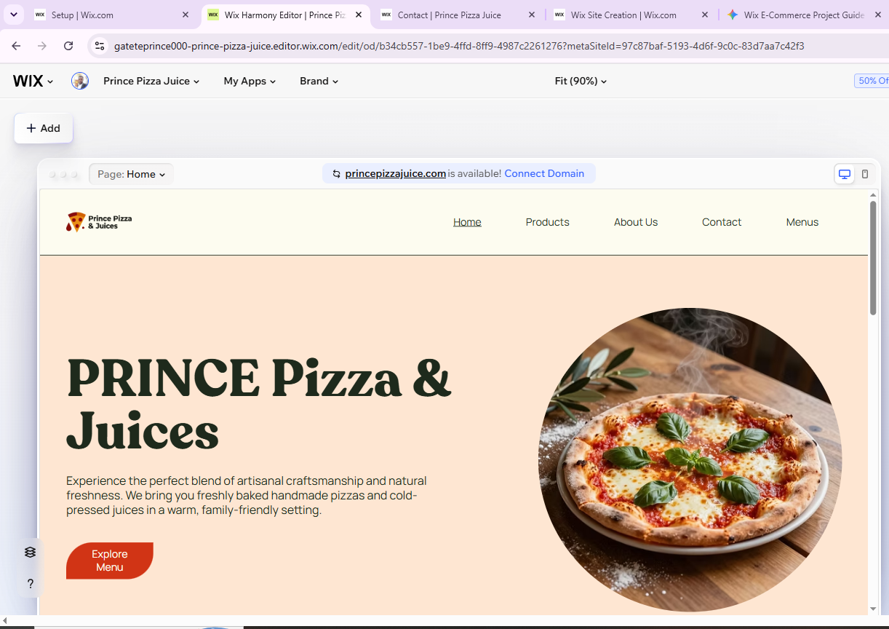
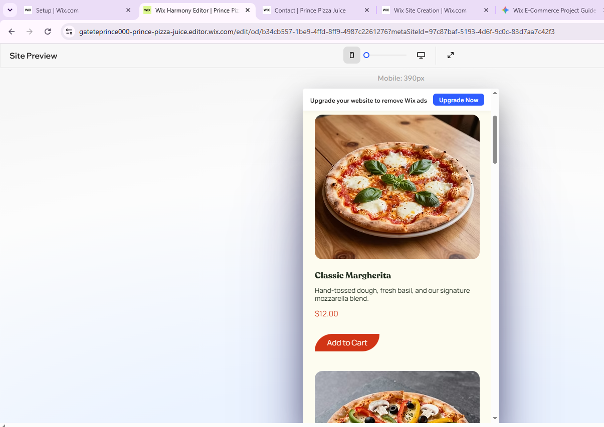
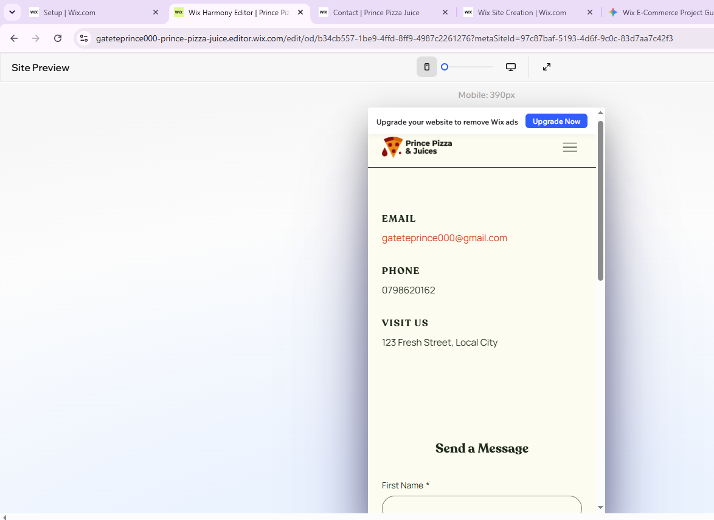
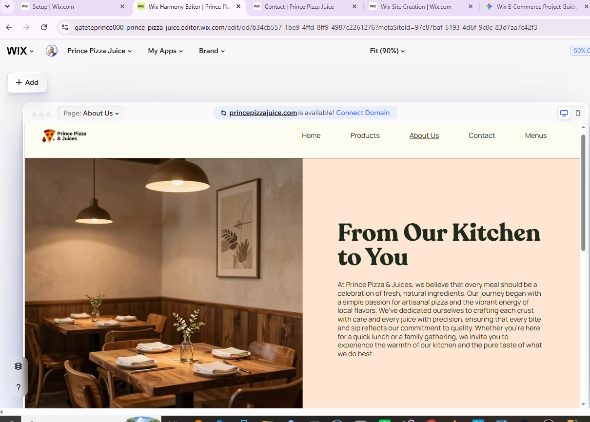

# Prince Pizza&Juice E-Commerce Project

## Student Information
Name: GATETE PRINCE
Student ID: 23814/2024
Group: Day / MY OWN GROUP
Institution: University of Lay Adventists of Kigali (UNILAK)
Course: E-Commerce And Web Application Course (EWA408510)
Lecturer: MR Eric Maniraguha

## Project Overview
Project Title: Prince Pizza&Juice  
Platform Used: Wix.com  
Live Website Link: http://gateteprince000.wixsite.com/prince-pizza-juice
GitHub Repository Link: https://github.com/jalla211/prince-e-commerce-project  

## Features Implemented
1. Homepage: I designed a clean hero layout that highlights our custom brand name and features an engaging welcome message for Prince Pizza Juice visitors.
2. Product Catalog: I added fully customized items, establishing designated prices, clear images, and rich descriptions  and add to cart button for each product.
3. About Us Section: I wrote a dedicated section explaining our brand origin story alongside our core market mission.
4. Contact Channels: I included active placeholder contact details and integrated an interactive Wix feedback form for user inquiries.
5. Cart System: I configured the built-in Wix Store features so users can seamlessly add items to a shopping cart simulation.

## Website Screenshots

### 1. Homepage

### 2. Product Page

### 3. Contact Page

### 4. About Us Page

## Challenges Faced
1. Navigating the Wix Editor Layout: As a first-time to use  this platform, locating specific structural settings within the Wix Stores dashboard layout took some initial trial and error.
2. Markdown File Links: It took me a moment to figure out how to properly link the relative image names so they would render natively in the repository overview.

## Lessons Learned
1. Power of No-Code Tools: I learned how rapidly an e-commerce minimum viable product can be styled, managed, and launched globally using drag-and-drop systems.
2. GitHub and Documentation Skills: I gained hands-on experience organizing developer repositories and using Markdown structural elements to generate a report without relying on external Word or PDF tools.
